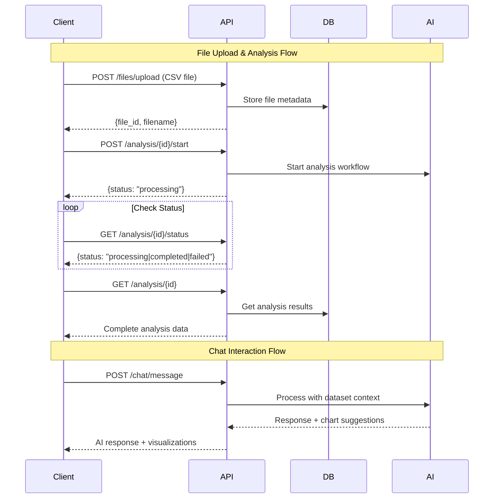

# API Documentation

DataQuest AI provides a RESTful API built with FastAPI for data analysis and conversational AI interactions.

## 🔗 Interactive Documentation

When running the backend locally, you can access interactive API documentation at:
- **Swagger UI**: http://localhost:8000/docs
- **ReDoc**: http://localhost:8000/redoc

## 📋 API Endpoints Overview

### File Management
| Method | Endpoint | Description |
|--------|----------|-------------|
| `POST` | `/api/v1/files/upload` | Upload CSV file for analysis |
| `POST` | `/api/v1/files/analysis/{id}/start` | Start analysis workflow |
| `GET` | `/api/v1/files/analysis/{id}/status` | Get analysis status |
| `GET` | `/api/v1/files/analysis/{id}` | Get analysis results |

### Chat Interface  
| Method | Endpoint | Description |
|--------|----------|-------------|
| `POST` | `/api/v1/chat/message` | Send chat message for AI analysis |
| `GET` | `/api/v1/chat/conversation/{id}` | Get conversation history |

### System
| Method | Endpoint | Description |
|--------|----------|-------------|
| `GET` | `/health` | Health check endpoint |
| `GET` | `/` | API information |
| `GET` | `/api/v1/test` | Test endpoint |

## 🔄 Typical API Flow



## 📝 Request/Response Examples

### File Upload

**Request:**
```bash
curl -X POST "http://localhost:8000/api/v1/files/upload" \
  -H "Content-Type: multipart/form-data" \
  -F "file=@business_data.csv"
```

**Response:**
```json
{
  "success": true,
  "message": "File uploaded successfully",
  "file_id": 123,
  "filename": "business_data.csv",
  "file_size": 15420
}
```

### Chat Message

**Request:**
```bash
curl -X POST "http://localhost:8000/api/v1/chat/message" \
  -H "Content-Type: application/json" \
  -d '{
    "analysis_id": 123,
    "message": "Show me the key insights from this data",
    "conversation_history": []
  }'
```

**Response:**
```json
{
  "message": {
    "id": "assistant-1699123456789",
    "type": "assistant", 
    "content": "Here are the key insights from your data:\n\n1. Strong correlation between sales and profit (0.89)\n2. Regional differences show 23% variance in performance\n3. Seasonal patterns indicate Q4 peak performance",
    "timestamp": "2024-01-15T10:30:00Z",
    "analysis_id": 123,
    "chart_type": "correlation"
  },
  "chart_suggestion": "correlation",
  "error": null
}
```

## 🛡️ Error Handling

The API uses standard HTTP status codes:

| Code | Description | Example |
|------|-------------|---------|
| `200` | Success | Request completed successfully |
| `400` | Bad Request | Invalid file format or missing parameters |
| `404` | Not Found | Analysis ID doesn't exist |
| `422` | Validation Error | Invalid request body schema |
| `500` | Server Error | Internal processing error |

**Error Response Format:**
```json
{
  "detail": "Analysis not found",
  "error_code": "ANALYSIS_NOT_FOUND",
  "timestamp": "2024-01-15T10:30:00Z"
}
```

## 📊 Data Models

### Analysis Status Response
```typescript
interface AnalysisStatus {
  id: number;
  status: "processing" | "completed" | "failed";
  filename: string;
  created_at: string;
  completed_at?: string;
  error_message?: string;
}
```

### Analysis Results
```typescript
interface AnalysisResults {
  id: number;
  filename: string;
  status: string;
  data_profile: {
    shape: [number, number];
    columns: string[];
    dtypes: Record<string, string>;
    missing_data: Record<string, number>;
    numeric_columns: string[];
    categorical_columns: string[];
    sample_data: Record<string, any>[];
  };
  analysis_results: {
    summary: {
      total_rows: number;
      total_columns: number;
      missing_percentage: number;
    };
    correlations: Array<{
      column1: string;
      column2: string;
      correlation: number;
    }>;
    categorical_distribution: Record<string, Record<string, number>>;
  };
  insights: string[];
}
```

### Chat Message
```typescript
interface ChatMessage {
  id: string;
  type: "user" | "assistant";
  content: string;
  timestamp: string;
  analysis_id?: number;
  chart_data?: any;
  chart_type?: string;
  error?: string;
}
```

## 🔐 Authentication

Currently, the API does not require authentication. For production deployments:
- Implement JWT token authentication
- Add rate limiting per user/API key
- Set up proper CORS origins
- Enable HTTPS only

## 🚀 Rate Limits

Development environment has no rate limits. Production recommendations:
- 100 requests/minute per IP for file uploads
- 500 requests/minute per IP for chat messages  
- 1000 requests/minute per IP for status checks

## 📈 Monitoring

Health check endpoint provides system status:

```bash
GET /health
```

Response includes:
- Service status
- Database connectivity
- API version
- Timestamp

---

🔗 **Interactive Docs**: http://localhost:8000/docs (when backend is running)