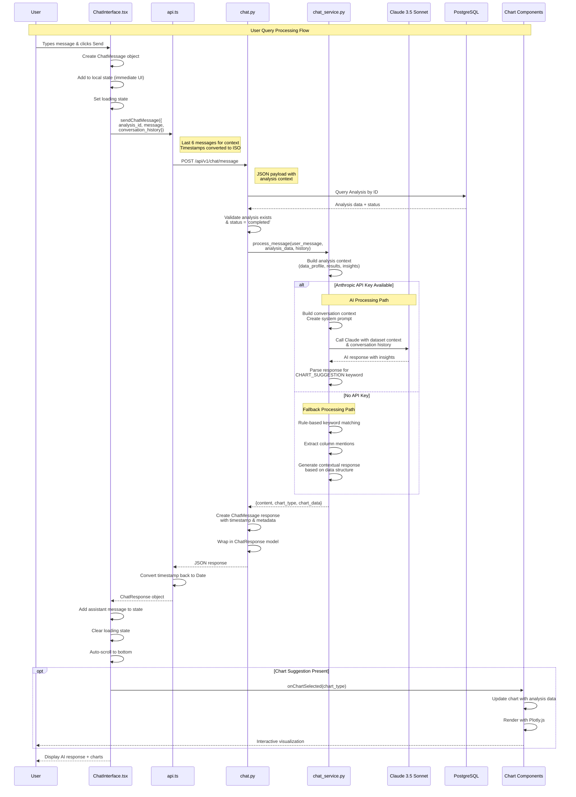
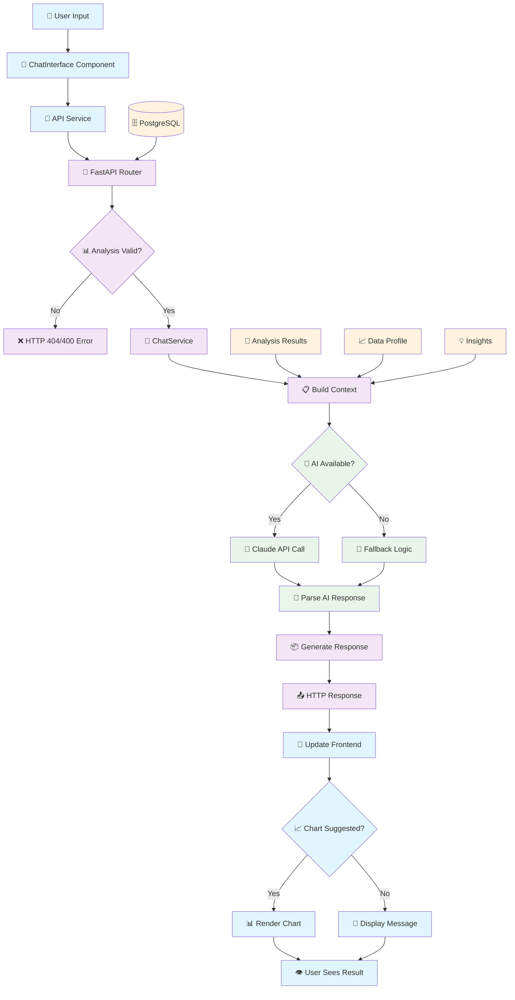
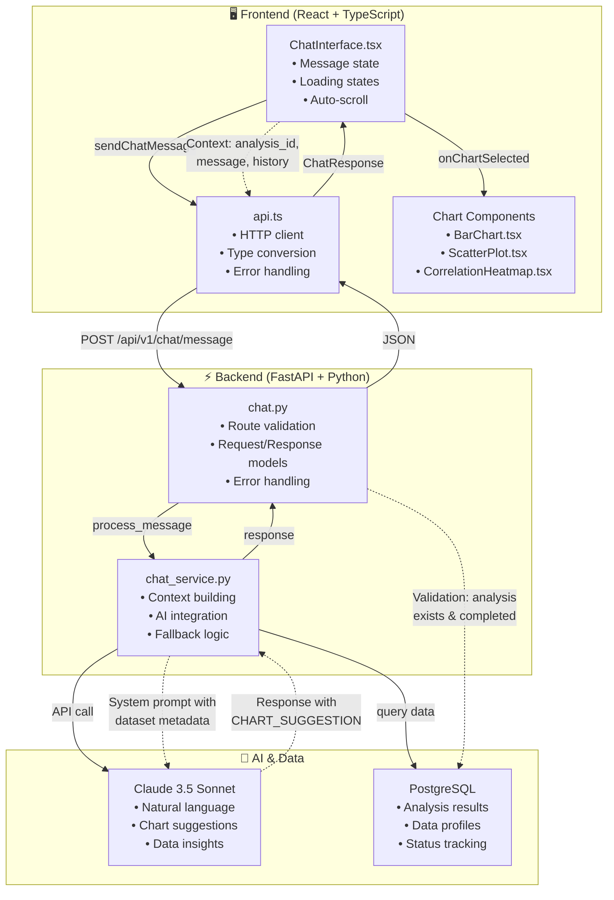
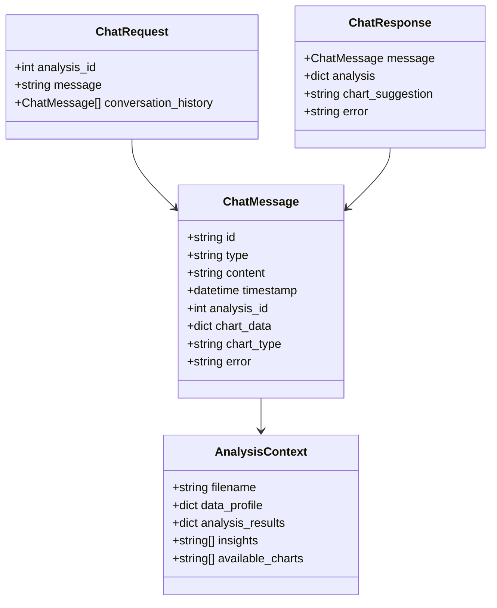

# User Query Processing Flow Diagram

```mermaid
sequenceDiagram
    participant User
    participant ChatInterface as ChatInterface.tsx
    participant ApiService as api.ts
    participant FastAPI as chat.py
    participant ChatService as chat_service.py
    participant AnthropicAPI as Claude 3.5 Sonnet
    participant Database as PostgreSQL
    participant Charts as Chart Components

    Note over User, Charts: User Query Processing Flow

    %% User Input Phase
    User->>ChatInterface: Types message & clicks Send
    ChatInterface->>ChatInterface: Create ChatMessage object
    ChatInterface->>ChatInterface: Add to local state (immediate UI)
    ChatInterface->>ChatInterface: Set loading state

    %% Frontend API Call
    ChatInterface->>ApiService: sendChatMessage({<br/>analysis_id, message,<br/>conversation_history})
    Note right of ApiService: Last 6 messages for context<br/>Timestamps converted to ISO

    %% HTTP Request
    ApiService->>FastAPI: POST /api/v1/chat/message
    Note right of FastAPI: JSON payload with<br/>analysis context

    %% Backend Validation
    FastAPI->>Database: Query Analysis by ID
    Database-->>FastAPI: Analysis data + status
    FastAPI->>FastAPI: Validate analysis exists<br/>& status = 'completed'

    %% Chat Service Processing
    FastAPI->>ChatService: process_message(user_message,<br/>analysis_data, history)
    ChatService->>ChatService: Build analysis context<br/>(data_profile, results, insights)

    %% AI vs Fallback Decision
    alt Anthropic API Key Available
        Note over ChatService, AnthropicAPI: AI Processing Path
        ChatService->>ChatService: Build conversation context<br/>Create system prompt
        ChatService->>AnthropicAPI: Call Claude with dataset context<br/>& conversation history
        AnthropicAPI-->>ChatService: AI response with insights
        ChatService->>ChatService: Parse response for<br/>CHART_SUGGESTION keyword
    else No API Key
        Note over ChatService: Fallback Processing Path
        ChatService->>ChatService: Rule-based keyword matching
        ChatService->>ChatService: Extract column mentions
        ChatService->>ChatService: Generate contextual response<br/>based on data structure
    end

    %% Response Generation
    ChatService-->>FastAPI: {content, chart_type, chart_data}
    FastAPI->>FastAPI: Create ChatMessage response<br/>with timestamp & metadata
    FastAPI->>FastAPI: Wrap in ChatResponse model

    %% HTTP Response
    FastAPI-->>ApiService: JSON response
    ApiService->>ApiService: Convert timestamp back to Date
    ApiService-->>ChatInterface: ChatResponse object

    %% Frontend Update
    ChatInterface->>ChatInterface: Add assistant message to state
    ChatInterface->>ChatInterface: Clear loading state
    ChatInterface->>ChatInterface: Auto-scroll to bottom

    %% Chart Integration
    opt Chart Suggestion Present
        ChatInterface->>Charts: onChartSelected(chart_type)
        Charts->>Charts: Update chart with analysis data
        Charts->>Charts: Render with Plotly.js
        Charts-->>User: Interactive visualization
    end

    %% Final Display
    ChatInterface-->>User: Display AI response + charts
```

## Architecture Flow Diagram

```mermaid
flowchart TD
    A[👤 User Input] --> B[💬 ChatInterface Component]
    B --> C[📡 API Service]
    C --> D[🚀 FastAPI Router]
    
    D --> E{📊 Analysis Valid?}
    E -->|No| F[❌ HTTP 404/400 Error]
    E -->|Yes| G[🧠 ChatService]
    
    G --> H[📋 Build Context]
    H --> I{🔑 AI Available?}
    
    I -->|Yes| J[🤖 Claude API Call]
    I -->|No| K[🔧 Fallback Logic]
    
    J --> L[📝 Parse AI Response]
    K --> L
    
    L --> M[📦 Generate Response]
    M --> N[📤 HTTP Response]
    N --> O[🔄 Update Frontend]
    
    O --> P{📈 Chart Suggested?}
    P -->|Yes| Q[📊 Render Chart]
    P -->|No| R[💭 Display Message]
    
    Q --> S[👁️ User Sees Result]
    R --> S

    %% Data Sources
    T[(🗄️ PostgreSQL)] --> D
    U[📁 Analysis Results] --> H
    V[📈 Data Profile] --> H
    W[💡 Insights] --> H

    %% Styling
    classDef frontend fill:#e1f5fe
    classDef backend fill:#f3e5f5
    classDef ai fill:#e8f5e8
    classDef data fill:#fff3e0
    
    class A,B,C,O,P,Q,R,S frontend
    class D,E,F,G,H,M,N backend
    class I,J,K,L ai
    class T,U,V,W data
```

## Component Interaction Map

```mermaid
graph TB
    subgraph "🖥️ Frontend (React + TypeScript)"
        A[ChatInterface.tsx<br/>• Message state<br/>• Loading states<br/>• Auto-scroll]
        B[api.ts<br/>• HTTP client<br/>• Type conversion<br/>• Error handling]
        C[Chart Components<br/>• BarChart.tsx<br/>• ScatterPlot.tsx<br/>• CorrelationHeatmap.tsx]
    end
    
    subgraph "⚡ Backend (FastAPI + Python)"
        D[chat.py<br/>• Route validation<br/>• Request/Response models<br/>• Error handling]
        E[chat_service.py<br/>• Context building<br/>• AI integration<br/>• Fallback logic]
    end
    
    subgraph "🧠 AI & Data"
        F[Claude 3.5 Sonnet<br/>• Natural language<br/>• Chart suggestions<br/>• Data insights]
        G[PostgreSQL<br/>• Analysis results<br/>• Data profiles<br/>• Status tracking]
    end
    
    A -->|sendChatMessage| B
    B -->|POST /api/v1/chat/message| D
    D -->|process_message| E
    E -->|API call| F
    E -->|query data| G
    
    E -->|response| D
    D -->|JSON| B
    B -->|ChatResponse| A
    A -->|onChartSelected| C
    
    %% Data flow annotations
    A -.->|"Context: analysis_id,<br/>message, history"| B
    D -.->|"Validation: analysis<br/>exists & completed"| G
    E -.->|"System prompt with<br/>dataset metadata"| F
    F -.->|"Response with<br/>CHART_SUGGESTION"| E
```

## Key Data Structures

```mermaid
classDiagram
    class ChatRequest {
        +int analysis_id
        +string message
        +ChatMessage[] conversation_history
    }
    
    class ChatMessage {
        +string id
        +string type
        +string content
        +datetime timestamp
        +int analysis_id
        +dict chart_data
        +string chart_type
        +string error
    }
    
    class ChatResponse {
        +ChatMessage message
        +dict analysis
        +string chart_suggestion
        +string error
    }
    
    class AnalysisContext {
        +string filename
        +dict data_profile
        +dict analysis_results
        +string[] insights
        +string[] available_charts
    }
    
    ChatRequest --> ChatMessage
    ChatResponse --> ChatMessage
    ChatMessage --> AnalysisContext
```